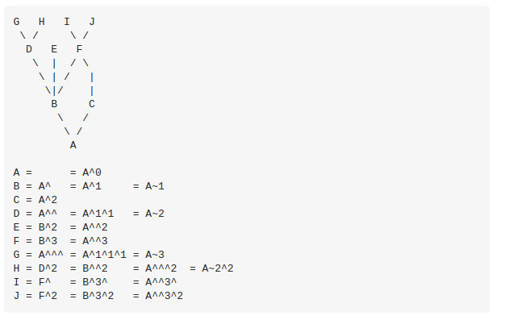
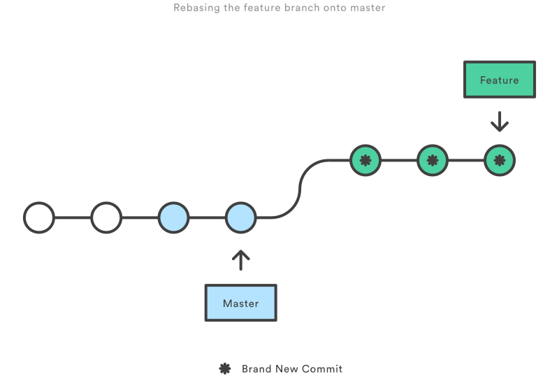
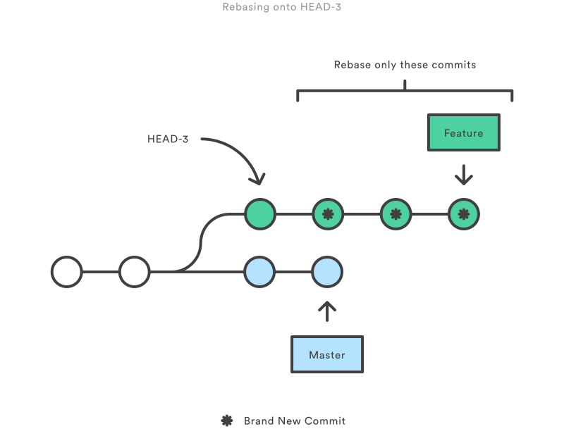
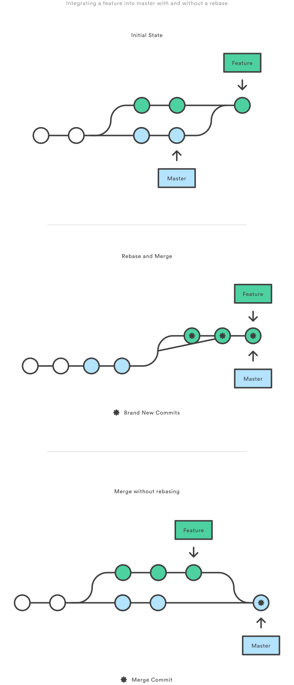

# 11. Caret vs Tilde (^ vs ~), Rebase, Interactive Rebase 

## 1. Caret vs Tilde (^ vs ~)

## 2. Rebase
### 1. &nbsp;&nbsp;`git rebase master`
* --continue
* --abort

### &nbsp;&nbsp; `git rebase -i HEAD~3`

## 3. Interactive Rebase 
### 1. git rebase  -i
git rebase -- d
git rebase -- p 
git rebase -- x

### &nbsp;&nbsp;Commands:
* &nbsp;&nbsp;p, pick <commit> = use commit
* &nbsp;&nbsp;r, reword <commit> = use commit, but edit the commit message
* &nbsp;&nbsp;e, edit <commit> = use commit, but stop for amending
* &nbsp;&nbsp;s, squash <commit> = use commit, but meld into previous commit
* &nbsp;&nbsp;f, fixup <commit> = like "squash", but discard this commit's log message
* &nbsp;&nbsp;x, exec <command> = run command (the rest of the line) using shell
* &nbsp;&nbsp;b, break = stop here (continue rebase later with 'git rebase --continue')
* &nbsp;&nbsp;d, drop <commit> = remove commit
* &nbsp;&nbsp;l, label <label> = label current HEAD with a name
* &nbsp;&nbsp;t, reset <label> = reset HEAD to a label
* &nbsp;&nbsp;m, merge [-C <commit> | -c <commit>] <label> [# <oneline>]
 .       &nbsp;&nbsp;create a merge commit using the original merge commit's
 .       &nbsp;&nbsp;message (or the oneline, if no original merge commit was
 .       &nbsp;&nbsp;specified). Use -c <commit> to reword the commit message.

### 2. git rebase --onto master featureA featureB 

## 4. Git Cherry Pick
### 1. `git cherry-pick commitSha`
* -edit
* --no-commit

